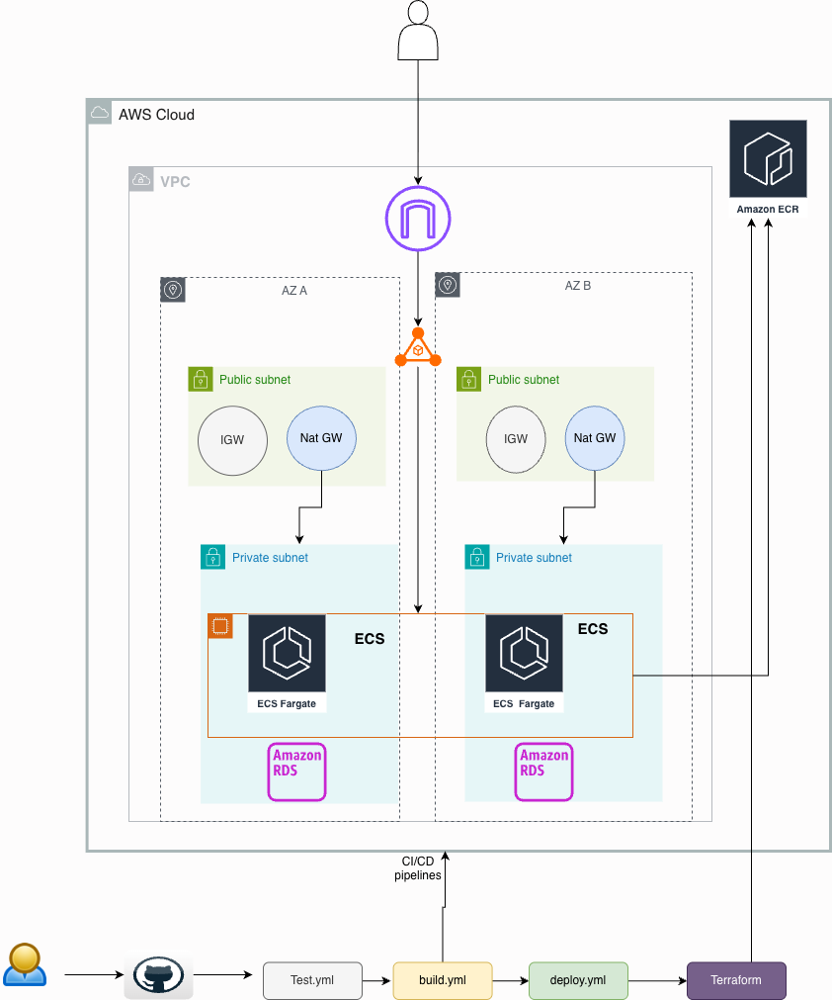
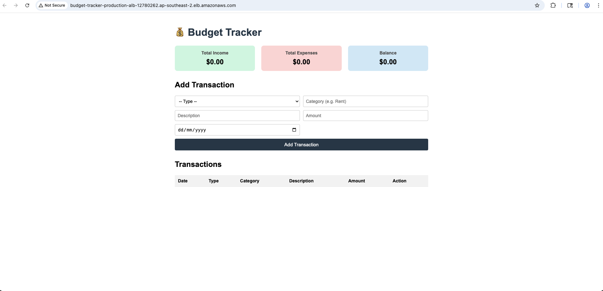
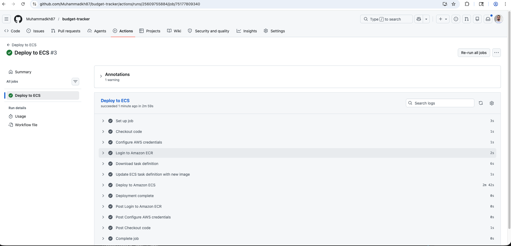

# Budget Tracker — End to End DevOps Project

A production grade budget tracking web application built to demonstrate a full DevOps workflow — from local development to containerisation, cloud deployment, infrastructure as code, and automated CI/CD pipelines.

---

## Architecture Overview

The application follows a **3-tier architecture** deployed on AWS across two availability zones for high availability:

```
User → Internet Gateway → ALB → ECS Fargate → RDS PostgreSQL
                                     ↑
                               ECR (Docker image)
```

**Traffic flow (User side):**
- User sends HTTP request to the ALB DNS URL
- Request enters the VPC via the Internet Gateway
- ALB (in public subnet) forwards to a healthy ECS task
- ECS container (in private subnet) queries RDS PostgreSQL
- Response returns to the user

**Deployment flow (Developer side):**
- Developer pushes code to GitHub main branch
- GitHub Actions triggers the CI/CD pipeline automatically
- Docker image is built and pushed to Amazon ECR
- ECS service pulls the latest image and deploys it
- Zero manual steps required

---

## 🛠️ Tech Stack

| Layer | Technology |
|---|---|
| **Application** | Node.js, Express.js |
| **Frontend** | Plain HTML, CSS, JavaScript |
| **Database (local)** | SQLite |
| **Database (production)** | PostgreSQL 15 on AWS RDS |
| **Containerisation** | Docker (multistage build) |
| **Container Registry** | Amazon ECR |
| **Container Orchestration** | Amazon ECS Fargate |
| **Load Balancer** | AWS Application Load Balancer |
| **Networking** | AWS VPC, Public/Private Subnets, NAT Gateway |
| **Infrastructure as Code** | Terraform (modular) |
| **CI/CD** | GitHub Actions (3 pipeline files) |
| **Cloud Provider** | AWS ap-southeast-2 (Sydney) |

---

## Project Structure

```
budget-tracker/
├── public/
│   └── index.html              # Frontend UI
├── .github/
│   └── workflows/
│       ├── test.yml            # Pipeline 1 — run tests
│       ├── build.yml           # Pipeline 2 — build & push to ECR
│       └── deploy.yml          # Pipeline 3 — deploy to ECS
├── terraform/
│   ├── main.tf                 # Root module — wires everything together
│   ├── variables.tf            # Input variable definitions
│   ├── outputs.tf              # Output values (app URL, endpoints)
│   ├── providers.tf            # AWS provider configuration
│   ├── terraform.tfvars        # Actual variable values (gitignored)
│   └── modules/
│       ├── vpc/                # VPC, subnets, IGW, NAT Gateway
│       ├── security-groups/    # ALB, ECS, RDS security groups
│       ├── ecr/                # Container registry
│       ├── alb/                # Application Load Balancer
│       ├── ecs/                # ECS cluster, service, task definition
│       └── rds/                # PostgreSQL database
├── database.js                 # Database connection and queries
├── server.js                   # Express server and API routes
├── Dockerfile                  # Multistage Docker build
├── docker-compose.yml          # Local development setup
├── .dockerignore
└── .gitignore
```

---

## Getting Started

### Prerequisites

```bash
node --version    # v20 or higher
docker --version  # Docker Desktop running
terraform --version
aws --version
```

### Run Locally

```bash
# Clone the repository
git clone https://github.com/Muhammadkh87/budget-tracker.git
cd budget-tracker

# Install dependencies
npm install

# Run the app
node server.js

# Visit http://localhost:3000
```

### Run with Docker Compose

```bash
# Build and start
docker compose up

# Run in background
docker compose up -d

# Stop
docker compose down
```

---

## AWS Infrastructure

All infrastructure is managed with **Terraform** using a modular approach. Each AWS service has its own module with `main.tf`, `variables.tf`, and `outputs.tf`.

### Modules

| Module | Resources Created |
|---|---|
| `vpc` | VPC, public/private subnets, IGW, NAT Gateway, route tables |
| `security-groups` | sg-alb, sg-ecs, sg-rds with chained rules |
| `ecr` | Private container registry with lifecycle policy |
| `alb` | Application Load Balancer, listener, target group |
| `ecs` | Cluster, task definition, Fargate service, IAM roles |
| `rds` | PostgreSQL 15 instance, subnet group, automated backups |

### Security Group Chain

```
Internet → sg-alb (port 80)
         → sg-ecs (port 3000 from sg-alb only)
           → sg-rds (port 5432 from sg-ecs only)
```

The database is never directly accessible from the internet.

### Deploy Infrastructure

```bash
cd terraform

# Initialise
terraform init

# Preview changes
terraform plan

# Apply
terraform apply

# Destroy when done
terraform destroy
```

### Outputs after apply

```
app_url            = "http://budget-tracker-production-alb-xxx.ap-southeast-2.elb.amazonaws.com"
ecr_repository_url = "853191155610.dkr.ecr.ap-southeast-2.amazonaws.com/budget-tracker-production"
ecs_cluster_name   = "budget-tracker-production-cluster"
ecs_service_name   = "budget-tracker-production-service"
rds_endpoint       = "budget-tracker-production-db.xxx.ap-southeast-2.rds.amazonaws.com:5432"
```

---

## CI/CD Pipeline

Three separate GitHub Actions workflows handle the full deployment pipeline:

```
git push to main
      │
      ▼
test.yml        → installs dependencies, verifies app starts
      │ passes
      ▼
build.yml       → builds Docker image (linux/amd64), pushes to ECR
      │ passes
      ▼
deploy.yml      → updates ECS task definition, deploys new container
      │
      ▼
App live on AWS 
```

### Pipeline Features
- Tests must pass before build runs
- Build must pass before deploy runs
- Images tagged with both `:latest` and commit SHA for traceability
- ECS waits for service stability before marking deployment successful
- AWS credentials stored securely in GitHub Secrets (never in code)

### Required GitHub Secrets

```
AWS_ACCESS_KEY_ID
AWS_SECRET_ACCESS_KEY
AWS_REGION
```

---

## Security Practices

- **No hardcoded credentials** — all secrets via environment variables
- **IAM least privilege** — dedicated `devops-admin` IAM user (not root)
- **MFA enabled** on both root and IAM accounts
- **Private subnets** — ECS and RDS never directly exposed to internet
- **Security group chaining** — strict traffic rules between services
- **Sensitive variables** — `db_password` marked `sensitive = true` in Terraform
- **`.gitignore`** — `terraform.tfvars`, `.env`, `budget.db` never pushed to GitHub
- **ECR scanning** — Docker images automatically scanned for vulnerabilities on push
- **Default tags** — all resources tagged with `ManagedBy = terraform`

---

## Resource Naming Convention

All AWS resources follow a consistent naming pattern:

```
{project_name}-{environment}-{resource}

Examples:
budget-tracker-production-vpc
budget-tracker-production-alb
budget-tracker-production-cluster
budget-tracker-production-db
```

---

## Future Improvements

| Improvement | Description |
|---|---|
| **Remote state (S3)** | Store Terraform state file in S3 instead of locally. Allows team collaboration and prevents state conflicts |
| **State locking (DynamoDB)** | Use DynamoDB to lock state during applies. Prevents two people running `terraform apply` simultaneously |
| **HTTPS / SSL** | Add ACM certificate and configure ALB listener on port 443. Currently running HTTP only |
| **Custom domain** | Point a domain (e.g. budgettracker.com) to the ALB using Route 53 |
| **Multi-AZ RDS** | Enable `multi_az = true` on RDS for automatic failover to standby database |
| **Auto scaling** | Add ECS auto scaling based on CPU/memory metrics to handle traffic spikes |
| **AWS Secrets Manager** | Move database credentials from environment variables to Secrets Manager for better security |
| **Staging environment** | Add a separate staging environment using the same Terraform modules with different `tfvars` |
| **Monitoring** | Add CloudWatch dashboards and alarms for CPU, memory, error rates |
| **PostgreSQL migration** | Fully migrate the app from SQLite to PostgreSQL with proper migration scripts |

---

## Key Learnings

This project covers the following DevOps concepts end to end:

- **Containerisation** — multistage Docker builds, platform targeting (linux/amd64)
- **Infrastructure as Code** — modular Terraform, variable management, state
- **AWS Networking** — VPC design, public vs private subnets, NAT Gateway
- **Security** — IAM roles, security groups, least privilege principle
- **CI/CD** — multi-stage pipelines, secrets management, automated deployments
- **High Availability** — multi-AZ deployment, ALB health checks, ECS desired count

---

## Screenshots

### Architecture Diagram


### Application Running on AWS


### CI/CD Pipeline — All Stages Green


---

## Author

**Muhammad Khan**
- GitHub: [@Muhammadkh87](https://github.com/Muhammadkh87)
- Background: IT Support → Sysadmin → DevOps Engineer

---

## License

This project is open source and available under the [MIT License](LICENSE).
